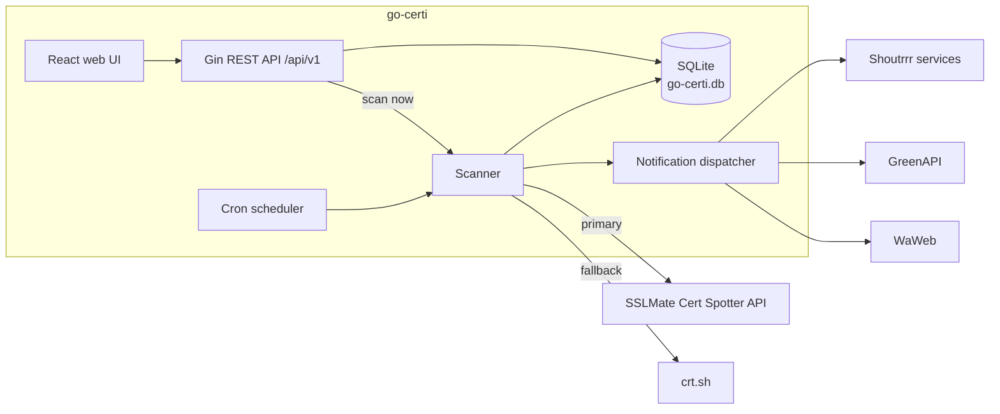

# go-certi

[](https://github.com/t0mer/go-certi/releases)
[](https://hub.docker.com/r/techblog/go-certi)
[](go.mod)
[](LICENSE)

**go-certi** is a Go rewrite and significant feature expansion of the original Python [t0mer/certi](https://github.com/t0mer/certi) project: an **SSL/TLS Certificate Transparency log monitor** that tracks certificates issued for the domains you care about and alerts you when something new appears, is about to expire, expires, is revoked, or comes from a different CA.

It is aimed at homelab users and small teams who want to know when anyone issues a certificate for their domains, without running a heavy monitoring stack.

---

## Table of Contents

- [Overview](#overview)
- [Features](#features)
- [How It Works](#how-it-works)
- [Screenshots](#screenshots)
- [Requirements](#requirements)
- [Installation](#installation)
- [Configuration](#configuration)
- [Running as a System Service](#running-as-a-system-service)
- [Usage](#usage)
- [Notification Events](#notification-events)
- [Notification Channel Config](#notification-channel-config)
- [Certificate Transparency Sources](#certificate-transparency-sources)
- [Application Updates](#application-updates)
- [API Reference](#api-reference)
- [Security Notes](#security-notes)
- [Troubleshooting](#troubleshooting)
- [Development](#development)
- [Tech Stack](#tech-stack)
- [Contributing](#contributing)
- [Credits](#credits)
- [License](#license)

---

## Overview

go-certi watches [Certificate Transparency](https://certificate.transparency.dev/) logs for your domains. Every time a new certificate is issued (by Let's Encrypt, a commercial CA, or anyone else), go-certi discovers it, stores it, and notifies you through the channel of your choice. It runs as a single statically linked binary with an embedded SQLite database and an embedded React web UI.

---

## Features

- **CT log monitoring**: fetches certificates from the [SSLMate Cert Spotter API](https://sslmate.com/ct_search_api/) (primary) with [crt.sh](https://crt.sh) as a fallback. Works anonymously; an optional API key unlocks higher Cert Spotter rate limits.
- **Subdomain coverage**: each monitored FQDN can optionally include all of its subdomains.
- **Scheduler**: cron-based scan schedules (`@every 2h`, `@daily`, or 6-field cron expressions with seconds). One schedule is the default; each FQDN can override it. On-demand scans are available from the UI and the API.
- **Configurable notification events** per domain:
  - 🆕 **New certificate issued**: a previously unseen certificate appears in CT logs
  - ⏳ **Expiring soon**: a certificate expires within a configurable number of days (default: 10)
  - ❌ **Expired**: a certificate has passed its expiry date
  - 🚫 **Revoked**: a certificate is marked as revoked by Cert Spotter
  - 🔄 **CA changed**: a newly discovered certificate comes from a different Certificate Authority than the previous one
- **Notification channels**: reusable targets that multiple domains can share:
  - 🔔 **Shoutrrr**: Telegram, Slack, Discord, email, and [many more services](https://containrrr.dev/shoutrrr/v0.8/services/overview/)
  - 💬 **GreenAPI**: WhatsApp via [green-api.com](https://green-api.com)
  - 💬 **WaWeb**: WhatsApp via [go-whatsapp-web-multidevice](https://github.com/aldinokemal/go-whatsapp-web-multidevice)
  - A **Test** button (and API endpoint) sends a sample notification to verify delivery.
- **Certificate details**: stores and displays CN, SANs, issuer (friendly name + full DN), issue date, expiry date with countdown, revocation status, and CT source. Filter by FQDN and search by CN, SAN, or CA.
- **Web UI**: mobile-first React + Tailwind UI with a light/dark/system theme.
- **REST API**: every UI action is backed by a `/api/v1` endpoint, documented with Swagger UI at `/swagger/index.html`.
- **Auth**: optional UI login (bcrypt password, JWT in an HttpOnly cookie) and optional API token protection. Both are off by default for homelab use. **Currently neither can be relied on** (the JWT signing key is fixed in the source); see [Security Notes](#security-notes).
- **Self-update**: checks the latest GitHub release and can download it, replace the running binary, and restart in place.
- **System service**: install/uninstall/start/stop/restart/status as a native service (systemd, SysV, Upstart, Windows SCM, launchd).
- **Single binary**: embedded SQLite database (pure Go, no CGO) and embedded frontend. No external runtime dependencies.
- **Release binaries** for Linux (`amd64`, `arm64`, `armv7`, `armhf` (ARMv6), `arm` (ARMv5)) and Windows (`amd64`, `arm64`).
- **Docker image** `techblog/go-certi` for `linux/amd64`, `linux/arm64`, and `linux/arm/v7`, based on distroless `static-debian12:nonroot`.

---

## How It Works



1. On startup, every **enabled** FQDN is registered with the cron scheduler using its own schedule, or the default schedule if it has none (falling back to `@every 2h`).
2. On each run, the scanner queries Cert Spotter; if that request fails (network error, non-200 response, or rate limit), it falls back to crt.sh.
3. Certificates not seen before for that FQDN are stored. If notifications are enabled for the FQDN and `new_cert` is among its notification events, a **new certificate** notification is sent for each one.
4. The scanner then checks the stored certificates for **expiring soon**, **expired**, **revoked**, and **CA changed** events and notifies the FQDN's channels, at most once per certificate and event every 24 hours.

---

## Screenshots

### Dashboard
Overview of monitored FQDNs, total certificates discovered, notification channels, and schedules. Recent certificates are listed with issuer and expiry.


---

### FQDNs
Monitor multiple domains. Each domain shows the number of configured channels and active notification events. Click ⚙ to open the configuration panel, where you can select notification channels and choose which events trigger alerts.


---

### FQDN Notification Configuration
Click the ⚙ gear button on any FQDN to configure:
- **Channels**: select which notification channels to use for this domain
- **Notify on**: choose any combination of New certificate, Expiring soon (with a configurable day threshold), Expired, Revoked, and CA changed

---

### Certificates
Paginated list of all discovered certificates. Shows subject CN, issuer (friendly name + full DN), issue date → expiry date with a relative countdown, SANs, source, and a **Revoked** badge when applicable. Filter by FQDN or search by CN/SAN/CA.


---

### Notification Channels
Create and manage reusable notification channels. Each channel has a **Test** button to verify delivery and a **✏ Edit** button to update the name or configuration at any time.


---

### Schedules
Define cron-based scan schedules (see [Schedules and cron syntax](#schedules-and-cron-syntax)). Mark one as the default; FQDNs without a custom schedule inherit it.


---

### Settings
- **Theme**: Light / Dark / System
- **sslmate API key**: see [Certificate Transparency Sources](#certificate-transparency-sources) for how the key is actually applied
- **UI Authentication**: require login with username + password
- **API Token Protection**: require `Authorization: Bearer <token>` on API requests; rotate the token at any time
- **Application Updates**: shows an enable toggle, an interval (in hours), and a **Check now** button. Only **Check now** currently has an effect: the toggle and interval are not saved (see [Application Updates](#application-updates)).

<!-- TODO: screenshot - the Settings screenshot predates the "Application Updates" card -->


---

### Login
Shown when UI authentication is enabled. Issues a signed JWT in an HttpOnly cookie on success.


---

### Swagger / API Docs
Interactive API documentation, available at `/swagger/index.html`. The `/api/v1/updates/*` endpoints are not included in the published spec.


---

## Requirements

- **Runtime**: nothing beyond the binary (or Docker). The SQLite database and the web UI are embedded.
- **Network**: outbound HTTPS to `api.certspotter.com` and/or `crt.sh`, to your notification providers, and to `api.github.com` if you use the update check.
- **Optional**: an [SSLMate Cert Spotter API key](https://sslmate.com/ct_search_api/) for higher rate limits.
- **Building from source**: Go 1.26+ (per `go.mod`) and Node.js 20+.

---

## Installation

### Binary

Download the binary for your platform from the [GitHub Releases](https://github.com/t0mer/go-certi/releases) page. Assets are named `go-certi_<version>_<os>_<arch>` (plus `.exe` on Windows), for example `go-certi_2026.5.0_linux_amd64`.

| OS | Asset suffixes |
|---|---|
| Linux | `linux_amd64`, `linux_arm64`, `linux_armv7`, `linux_armhf` (ARMv6), `linux_arm` (ARMv5) |
| Windows | `windows_amd64.exe`, `windows_arm64.exe` |

No macOS binaries are published; macOS users can [build from source](#building-from-source).

```bash
# Example: Linux amd64 (replace VERSION with the release you want)
VERSION=2026.5.0
curl -L -o go-certi \
  "https://github.com/t0mer/go-certi/releases/download/${VERSION}/go-certi_${VERSION}_linux_amd64"
chmod +x go-certi
./go-certi
```

Open **http://localhost:8111** in your browser.

### Docker

The image runs as the distroless `nonroot` user (UID/GID `65532`), stores its data in `/data`, and sets `GO_CERTI_CONF=/data`.

```bash
docker run -d \
  --name go-certi \
  -p 8111:8111 \
  -v go-certi-data:/data \
  techblog/go-certi:latest
```

> [!WARNING]
> The currently published image (`2026.5.0` / `latest`) has two known issues:
> - `/data` is not writable by the `nonroot` user, so the container exits with `open /data/config.json: permission denied`. Use a host directory owned by UID `65532` (`mkdir data && sudo chown 65532:65532 data`, then `-v "$PWD/data:/data"`), or run the container with `--user 0`.
> - The image does not contain the built web UI assets, so the UI loads as a blank page. The REST API and Swagger UI work. Use a [release binary](#binary) if you need the web UI.

### Docker Compose

```yaml
services:
  go-certi:
    image: techblog/go-certi:latest
    ports:
      - "8111:8111"
    volumes:
      - ./data:/data                             # must be owned by UID 65532 (see warning above)
    environment:
      GO_CERTI_SSLMATE_API_KEY: "your-key-here"  # optional
    restart: unless-stopped
```

The repository's own [`docker-compose.yaml`](docker-compose.yaml) builds the image locally from the `Dockerfile` instead of pulling it.

### From source

See [Building from source](#building-from-source) under Development.

---

## Configuration

All startup options can be provided as CLI flags **or** environment variables. **Environment variables always win over flags**, which is convenient for container deployments. Everything else (domains, channels, schedules, auth, theme) is configured in the web UI or through the API and stored in the database.

| Flag | Env var | Default | Description |
|---|---|---|---|
| `--port`, `-p` | `GO_CERTI_PORT` | `8111` | HTTP server port (listens on all interfaces, `0.0.0.0`) |
| `--conf` | `GO_CERTI_CONF` | see below | Config + database directory |
| `--sslmate-api-key` | `GO_CERTI_SSLMATE_API_KEY` | _(none)_ | SSLMate Cert Spotter API key |
| `--reset-password` | `GO_CERTI_RESET_PASSWORD` | `false` | Generate a new UI password, enable UI auth, print the password, and exit |
| `--reset-api-token` | `GO_CERTI_RESET_API_TOKEN` | `false` | Generate a new API token, enable API token protection, print the token, and exit |
| `--service <action>` | `GO_CERTI_SERVICE` | _(none)_ | Manage as a system service. See [Running as a System Service](#running-as-a-system-service) |
| `--version` | — | — | Print the version and exit |
| `--help`, `-h` | — | — | Print usage and exit |

Notes:

- Boolean env vars (`GO_CERTI_RESET_PASSWORD`, `GO_CERTI_RESET_API_TOKEN`) are enabled only by `true` or `1`. Empty env vars are ignored.
- An invalid `GO_CERTI_PORT` value is ignored and the flag value is used.
- The default `--conf` directory is `$XDG_CONFIG_HOME/go-certi` if `XDG_CONFIG_HOME` is set, otherwise `%AppData%\go-certi` on Windows, otherwise `$HOME/.config/go-certi`. The Docker image uses `/data`.
- Logs are written to stderr at `INFO` level through Go's default logger (`2026/01/02 15:04:05 INFO message key=value`).

Config and the SQLite database are stored in the `--conf` directory, which is created (mode `0700`) on first run:

```
<conf>/
├── config.json      # Created on first run; the effective port always comes from --port / GO_CERTI_PORT
└── go-certi.db      # SQLite database (WAL mode): settings, FQDNs, certificates, channels, schedules
```

### Resetting credentials offline

```bash
# Reset the login password (also enables UI authentication)
./go-certi --conf /data --reset-password

# Reset the API token (also enables API token protection)
./go-certi --conf /data --reset-api-token

# Inside the Docker container (GO_CERTI_CONF is already /data)
docker exec go-certi /go-certi --reset-password
```

Password reset keeps the existing username, so set a username in **Settings** before relying on it. Don't leave `GO_CERTI_RESET_PASSWORD` or `GO_CERTI_RESET_API_TOKEN` set on a long-running container: the process resets the credential and exits on every start.

---

## Running as a System Service

go-certi can register itself as a native system service on Linux (systemd / SysV / Upstart), Windows (Service Control Manager), and macOS (launchd) via the `--service` flag. On `install`, the service is registered and started immediately.

### Linux (systemd)

```bash
# Install and start: runs the binary at its current path with these args
sudo ./go-certi --service install --conf /var/lib/go-certi --port 8111

# Check status / logs
sudo systemctl status go-certi
sudo journalctl -u go-certi -f

# Uninstall
sudo ./go-certi --service uninstall
```

### Windows

Open an **Administrator** PowerShell or CMD:

```powershell
# Install (uses the binary's current location)
.\go-certi.exe --service install --conf C:\ProgramData\go-certi --port 8111

# Status
sc query go-certi

# Uninstall
.\go-certi.exe --service uninstall
```

### Supported `--service` actions

| Action | Description |
|---|---|
| `install` | Register the service with the OS and start it. The current binary path and the `--conf` / `--port` values are baked into the service definition. |
| `uninstall` | Stop and remove the service. |
| `start` | Start the service. |
| `stop` | Stop the service. |
| `restart` | Restart the service. |
| `status` | Print whether the service is `running`, `stopped`, or `unknown`. |

### Notes

- **Move the binary first.** The service definition stores the absolute path of the binary at install time. If you move or rename the binary, the service breaks; uninstall and reinstall to fix it.
- **Permissions.** `install` and `uninstall` require **root** on Linux/macOS and **Administrator** on Windows.
- **Service user.** Defaults to `root` on Linux/macOS and `LocalSystem` on Windows. To run as a different user, edit the unit file after install or create one manually.
- **Data directory.** The `--conf` path is converted to an absolute path at install time. Make sure it is writable by the service user; it is created on first run if it doesn't exist.
- **Only `--conf` and `--port` are stored.** Pass other options (such as the Cert Spotter API key) through the service's environment, for example `GO_CERTI_SSLMATE_API_KEY` in a systemd drop-in.

---

## Usage

A typical first run in the web UI:

1. **Schedules**: a default schedule, *Every 2 hours* (`@every 2h`), is created automatically. Add others if needed and mark one as the default.
2. **Channels**: add a notification channel (Shoutrrr, GreenAPI, or WaWeb) and click **Test** to confirm delivery.
3. **FQDNs**: add a domain and use ⚙ to pick channels, notification events, and the expiry threshold. Use the scan button to run an immediate scan. Including subdomains and the per-FQDN notifications master toggle are currently available only through the [API](#fqdn-fields) (`include_subdomains`, `notifications_enabled`); the UI shows a *subdomains* badge but has no control for them.
4. **Certificates**: browse the discovered certificates, filter by FQDN, or search by CN/SAN/CA.
5. **Settings**: optionally enable UI authentication and/or API token protection.

The scheduler registers enabled FQDNs only when go-certi starts. Newly added FQDNs are not scanned on a schedule, changed FQDNs and schedules keep their old settings, and deleted or disabled FQDNs keep being scanned, until go-certi is restarted. Restart go-certi after changing FQDNs or schedules (manual scans always use the current settings).

### Schedules and cron syntax

Schedules use [robfig/cron v3](https://pkg.go.dev/github.com/robfig/cron/v3) **with a seconds field**. Valid expressions are:

- Descriptors: `@every 1h`, `@every 30m`, `@hourly`, `@daily`, `@weekly`, `@monthly`
- 6-field cron expressions (`second minute hour day-of-month month day-of-week`), for example `0 0 */4 * * *` for every 4 hours

Standard 5-field expressions such as `0 */4 * * *` are **not** accepted, and an FQDN with an invalid schedule is not scheduled (the error is logged at startup).

---

## Notification Events

Each FQDN can be configured to fire notifications on any combination of events (new FQDNs default to `new_cert` only):

| Event | Description | Dedup window |
|---|---|---|
| `new_cert` | A certificate not previously seen for this FQDN has appeared in CT logs | Fires once, when the cert is first stored |
| `expiring_soon` | A stored, non-revoked cert expires within the configured threshold | Once per cert every 24 hours |
| `expired` | A stored, non-revoked cert has passed its `not_after` date | Once per cert every 24 hours |
| `revoked` | A stored cert is marked revoked | Once per cert every 24 hours |
| `ca_changed` | A newly discovered cert uses a different Certificate Authority than the previously discovered one | Once per new cert |

The expiry threshold (default: **10 days**) is configurable per domain from the ⚙ panel. The FQDN's `notifications_enabled` flag (API only) disables all of its notifications.

Things to know:

- On the first scan of a domain, every certificate returned by CT logs is new, so `new_cert` sends one message per historical certificate.
- `expiring_soon`, `expired`, and `revoked` apply to **every stored certificate** for the domain, including older certificates that have since been replaced, and repeat every 24 hours while the condition holds.
- Revocation status comes from Cert Spotter when a certificate is first stored; crt.sh results never carry revocation status.

Notifications are **best-effort**: a failing channel is logged and never blocks a scan or takes down the scheduler.

---

## Notification Channel Config

Each channel has a `name`, a `type` (`shoutrrr`, `greenapi`, or `waweb`), an `enabled` flag, and a type-specific `config` object.

### Shoutrrr (Telegram, Slack, Discord, email, and more)

```json
{ "url": "telegram://token@telegram?chats=123456789" }
```

See the [Shoutrrr service docs](https://containrrr.dev/shoutrrr/v0.8/services/overview/) for all supported services and URL formats.

### GreenAPI (WhatsApp)

```json
{
  "instance_id": "your-instance-id",
  "api_token_instance": "your-api-token",
  "chat_id": "972501234567@c.us",
  "api_url": "https://api.green-api.com"
}
```

- `instance_id`, `api_token_instance`, and `chat_id` are required.
- `chat_id` is sent as-is, so include the `@c.us` suffix (or `@g.us` for groups).
- `api_url` defaults to `https://api.green-api.com`; set it to your instance's cluster URL if the GreenAPI console shows one.
- Messages are sent with `POST {api_url}/waInstance{instance_id}/sendMessage/{api_token_instance}`.

### WaWeb (WhatsApp via go-whatsapp-web-multidevice)

```json
{
  "base_url": "http://your-waweb-host:3000",
  "phone": "+972501234567",
  "auth": "Basic dXNlcjpwYXNz"
}
```

- `base_url` and `phone` are required. Messages are sent with `POST {base_url}/api/send/message` and a JSON body of `{"phone": ..., "message": ...}`.
- `auth` is optional and is sent verbatim as the `Authorization` header (for basic auth: `Basic ` followed by base64 of `user:password`).
<!-- TODO: verify - the phone format expected by your go-whatsapp-web-multidevice version and whether it serves /api/send/message or /send/message -->

---

## Certificate Transparency Sources

| Source | When it's used | Notes |
|---|---|---|
| [SSLMate Cert Spotter](https://sslmate.com/ct_search_api/) (`api.certspotter.com/v1/issuances`) | Always tried first | Anonymous access works with lower rate limits. An API key is sent as `Authorization: Bearer <key>`. Provides issuer friendly names and revocation status. |
| [crt.sh](https://crt.sh) | When the Cert Spotter request fails (network error, rate limit, non-200 response) | No key required. No revocation data. |

The API key used for Cert Spotter comes from `--sslmate-api-key` / `GO_CERTI_SSLMATE_API_KEY`, read once at startup. The **sslmate API key** field in **Settings** is saved to the database, but the scanner does not currently read it, so set the key with the flag or env var.

---

## Application Updates

The web UI checks `GET /api/v1/updates/status`, which compares the running version with the latest [GitHub release](https://github.com/t0mer/go-certi/releases). The update banner checks at most once every 24 hours. The enable toggle and interval under **Settings → Application Updates** are currently not saved, so the banner always uses the defaults (enabled, 24 hours); the **Check now** button there runs an immediate check.

When an update is available, a banner offers to skip the version, remind you later, or **update now**. Updating (`POST /api/v1/updates/apply`) downloads the first release asset whose name contains the running OS and architecture (on 32-bit ARM this is the first asset matching `arm`, i.e. `linux_arm`, the ARMv5 build), replaces the current binary, and restarts the process in place. This is intended for binary and service installs; for Docker, pull a new image instead.

---

## API Reference

Interactive documentation (Swagger 2.0, generated by swaggo) is available at **`/swagger/index.html`**; the raw spec is at `/swagger/doc.json`. The `/api/v1/updates/*` endpoints are missing from the committed spec (their annotations lack the `/api/v1` prefix, so regenerating the docs lists them under the wrong path).

**Base path:** `/api/v1`

| Method | Endpoint | Description |
|---|---|---|
| `GET` / `POST` | `/fqdns` | List / create FQDNs |
| `GET` / `PUT` / `DELETE` | `/fqdns/:id` | Get / update / delete an FQDN |
| `POST` | `/fqdns/:id/scan` | Trigger an immediate CT scan (runs in the background, returns `202`) |
| `GET` | `/certificates` | List certificates (`?fqdn=`, `?page=` (default 1), `?page_size=` (default 25; values below 1 or above 200 fall back to 25)) |
| `GET` | `/certificates/:id` | Get a certificate |
| `GET` | `/certificates/cas` | List distinct certificate authorities |
| `GET` / `POST` | `/channels` | List / create notification channels |
| `GET` / `PUT` / `DELETE` | `/channels/:id` | Get / update / delete a channel |
| `POST` | `/channels/:id/test` | Send a test notification |
| `GET` / `POST` | `/schedules` | List / create schedules |
| `GET` / `PUT` / `DELETE` | `/schedules/:id` | Get / update / delete a schedule |
| `GET` / `PUT` | `/settings` | Get / update application settings |
| `POST` | `/settings/api-token/rotate` | Generate a new API token (returned once in plaintext) |
| `GET` | `/updates/status` | Compare the running version with the latest GitHub release |
| `POST` | `/updates/apply` | Download the latest release, replace the binary, and restart |
| `POST` | `/auth/login` | Log in; sets the JWT cookie and returns the token |
| `POST` | `/auth/logout` | Clear the session cookie |
| `GET` | `/auth/me` | Currently authenticated username |

Outside `/api/v1`:

| Method | Endpoint | Description |
|---|---|---|
| `GET` | `/healthz` | Liveness probe (no auth, always `200`) |
| `GET` | `/readyz` | Readiness probe (pings the database; `200` or `503`) |
| `GET` | `/swagger/*` | Swagger UI and spec |

### FQDN fields

| Field | Type | Description |
|---|---|---|
| `fqdn` | string | Domain name to monitor (required, unique) |
| `include_subdomains` | bool | Also scan subdomains |
| `enabled` | bool | Pause/resume monitoring (default `true`) |
| `notifications_enabled` | bool | Master toggle for all notifications (default `true`) |
| `channel_ids` | []string | IDs of notification channels to use |
| `notification_events` | []string | Events to notify on (see [Notification Events](#notification-events); default `["new_cert"]`) |
| `expiry_threshold_days` | int | Days before expiry to trigger `expiring_soon` (default `10`) |
| `schedule_id` | string? | Override the default scan schedule |

### Example

```bash
# Add a domain (include the Authorization header only if API token protection is enabled)
curl -X POST http://localhost:8111/api/v1/fqdns \
  -H "Authorization: Bearer $GO_CERTI_TOKEN" \
  -H "Content-Type: application/json" \
  -d '{"fqdn": "example.com", "include_subdomains": true, "notification_events": ["new_cert", "expiring_soon"]}'

# List certificates for it
curl -H "Authorization: Bearer $GO_CERTI_TOKEN" \
  "http://localhost:8111/api/v1/certificates?fqdn=example.com&page_size=50"
```

### Authentication

| API Token Protection | UI Authentication | Protected `/api/v1` endpoints accept |
|---|---|---|
| off | off | Anyone (default) |
| off | on | A valid JWT (the `go_certi_token` cookie or `Authorization: Bearer <jwt>`) |
| on | any | `Authorization: Bearer <api-token>`, or a valid JWT |

`/auth/login` and `/auth/logout` are always open, and login only works when UI authentication is enabled. JWTs are valid for 24 hours.

---

## Security Notes

- **UI login and API token protection cannot currently be relied on.** The key used to sign login JWTs is a fixed value in the source code, identical for every installation, and a valid JWT is accepted in every auth mode, including when API token protection is enabled. Keep go-certi on a trusted network (not exposed to the internet, even behind a proxy) until this is fixed.
- **`--reset-password` uses a non-cryptographic random generator** (`math/rand`). Change the generated password in **Settings** after logging in.
- **Auth is off by default.** Anyone who can reach the port can read and change everything, including triggering a self-update. Enable UI authentication (and optionally API token protection) before exposing go-certi beyond a trusted network.
- **Enable UI authentication together with API token protection.** The web UI authenticates with the login cookie only, so turning on API token protection without UI authentication locks the UI out of the API.
- **Use HTTPS in front of it.** go-certi serves plain HTTP and its session cookie is not marked `Secure`. Put it behind a TLS-terminating reverse proxy if it is reachable from other machines.
- **Secrets are stored in plaintext in SQLite.** Channel configs (Shoutrrr URLs, GreenAPI tokens, WaWeb auth headers), the API token, and the Cert Spotter key are stored unencrypted in `go-certi.db`. Channel configs and `sslmate_api_key` are returned by the API to any client that passes auth; the API token is returned only once, by `POST /settings/api-token/rotate` (it is not included in `GET /settings`). The UI password is stored as a bcrypt hash. Protect the `--conf` directory (it is created with mode `0700`) and its backups.
- **Self-updates** download the release asset from GitHub over HTTPS without an extra checksum or signature check.

---

## Troubleshooting

- **`open /data/config.json: permission denied` in Docker**: the data directory isn't writable by UID `65532`. See the [Docker warning](#docker).
- **The web UI is a blank page**: the binary was built without the frontend assets (for example the published Docker image, or a `go build` without running `npm run build` first). Use a release binary, or build the frontend before the Go binary.
- **A schedule never runs**: 5-field cron expressions are rejected; use a descriptor or a 6-field expression. Check the startup logs for `scheduler: failed to register FQDN`.
- **Changes to a domain or schedule aren't picked up by scheduled scans**: restart go-certi (see [Usage](#usage)).
- **`sslmate fetch failed, falling back to crt.sh` in the logs**: Cert Spotter rejected or rate-limited the request (HTTP `429`). Set `GO_CERTI_SSLMATE_API_KEY` for higher limits.
- **Locked out of the UI**: run `--reset-password` (UI login) or `--reset-api-token` (API token) with the same `--conf` directory; see [Resetting credentials offline](#resetting-credentials-offline).
- **A notification channel doesn't deliver**: use the channel's **Test** button; the API returns the provider error (`502`), and scan-time failures are logged as `notification failed` / `event notification failed`.

---

## Development

**Prerequisites:** Go 1.26+ and Node.js 20+.

### Building from source

The frontend must be built **before** the Go binary, because `web/dist` is embedded at compile time. Without it, the binary serves a placeholder `index.html` whose assets are missing.

```bash
git clone https://github.com/t0mer/go-certi
cd go-certi

# Build the frontend (outputs to web/dist)
cd web && npm ci && npm run build && cd ..

# Build the binary (embeds the frontend)
go build -o go-certi ./cmd/go-certi

# Run
./go-certi --conf ./data
```

For frontend development, `npm run dev` in `web/` starts the Vite dev server, which proxies API requests to the Go server.

### Cross-compile all platforms

`scripts/build.sh` does not build the frontend; run `cd web && npm ci && npm run build` first, or the binaries serve a blank UI.

```bash
VERSION=1.0.0 BUILD_MODE=prod bash scripts/build.sh
# Binaries are written to dist/ as go-certi_<version>_<os>_<arch>[.exe]
```

`BUILD_MODE=prod` strips debug symbols. The version is injected into `github.com/t0mer/go-certi/internal/version.Version` via `-ldflags`. `OUTPUT_DIR` overrides the output directory.

### Run tests

```bash
go test ./... -race
```

### Regenerate Swagger docs

The generated `docs/docs.go`, `docs/swagger.json`, and `docs/swagger.yaml` are committed, so a fresh clone builds without this step. Regenerate them after changing API annotations:

```bash
go run github.com/swaggo/swag/cmd/swag@v1.16.6 init -g cmd/go-certi/main.go -d .,internal/api -o docs/
```

### Regenerate DB query code

Queries live in `internal/db/queries/`, the schema in `internal/db/migrations/`, and the generated code in `internal/models/` (see `sqlc.yaml`). sqlc is pinned as a Go tool dependency:

```bash
go tool sqlc generate
```

Migrations are embedded and applied automatically at startup.

### Project layout

```
cmd/go-certi/        # main package: flags, wiring, service integration
internal/api/        # Gin handlers, routes, auth middleware (swag annotations)
internal/auth/       # bcrypt passwords, JWT, API tokens
internal/config/     # conf dir resolution, config.json
internal/ct/         # Cert Spotter and crt.sh clients
internal/db/         # SQLite open, embedded migrations, sqlc queries
internal/models/     # sqlc-generated code
internal/notify/     # Shoutrrr, GreenAPI, WaWeb dispatchers
internal/scanner/    # scan, dedup, event detection
internal/scheduler/  # robfig/cron wrapper
internal/updater/    # GitHub release check and self-update
internal/version/    # build-time version
web/                 # React + Vite frontend (embedded from web/dist)
docs/                # generated Swagger spec, README screenshots
scripts/             # build.sh, next-version.sh
```

### Releases

Releases are cut manually with GitHub Actions:

- **Release** (`release.yml`): builds the frontend and all binaries, tags the commit with a date-based `YYYY.M.PATCH` version (computed by `scripts/next-version.sh` unless one is given), and publishes a GitHub Release.
- **Docker Build** (`docker.yml`): runs after a successful Release (or manually) and pushes `techblog/go-certi:latest` and `:<version>` for `linux/amd64`, `linux/arm64`, and `linux/arm/v7`.

---

## Tech Stack

| Layer | Technology |
|---|---|
| Language | Go 1.26+ |
| HTTP framework | [Gin](https://github.com/gin-gonic/gin) |
| Database | SQLite via [modernc.org/sqlite](https://pkg.go.dev/modernc.org/sqlite) (pure Go, no CGO) |
| DB queries | [sqlc](https://github.com/sqlc-dev/sqlc) (type-safe generated code) |
| Migrations | Hand-rolled embedded runner (`go:embed`) |
| Scheduler | [robfig/cron/v3](https://github.com/robfig/cron) |
| Notifications | [containrrr/shoutrrr](https://github.com/containrrr/shoutrrr) + GreenAPI HTTP + WaWeb HTTP |
| CT sources | [SSLMate Cert Spotter API](https://sslmate.com/ct_search_api/) + [crt.sh](https://crt.sh) fallback |
| Auth | [golang-jwt/jwt/v5](https://github.com/golang-jwt/jwt) + [golang.org/x/crypto/bcrypt](https://pkg.go.dev/golang.org/x/crypto/bcrypt) |
| API docs | [swaggo/swag](https://github.com/swaggo/swag) + [gin-swagger](https://github.com/swaggo/gin-swagger) (Swagger 2.0) |
| CLI flags | [spf13/pflag](https://github.com/spf13/pflag) |
| Service management | [kardianos/service](https://github.com/kardianos/service) |
| Frontend | React 18 + Vite + TypeScript + Tailwind CSS + TanStack Query |
| Logging | `log/slog` (structured, stdlib) |

---

## Contributing

Issues and pull requests are welcome. Before opening a PR, run `go test ./...`, build the frontend (`cd web && npm run build`), and regenerate the Swagger docs or sqlc code if you changed API annotations or queries.

---

## Credits

Inspired by the original [t0mer/certi](https://github.com/t0mer/certi) Python project by Tomer Klein.

---

## License

Licensed under the [Apache License 2.0](LICENSE).
